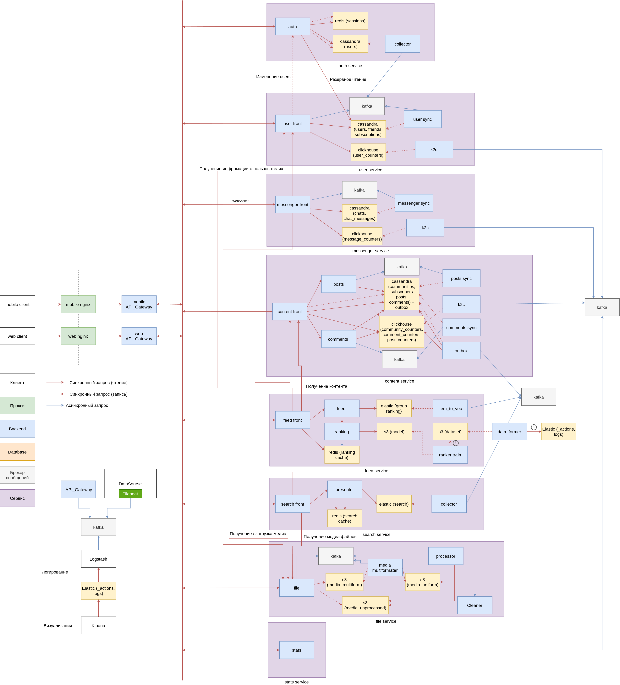

# highload_VK
Проект по курсу "Проектирование высоконагруженных систем" VK Education в МГТУ.

## 1. Тема и целевая аудитория 
**ВКонтакте**  — российская социальная сеть. 

### Целевая аудитория
**ВКонтакте** имеет более 105 миллионов активных пользователей в месяц[1].

| **Страна**              | **Количество пользователей в месяц, млн** |
| ----------------------- | ----------------------------------------- |
| Россия                  | 90 (Данные за 2024г.[2])                  |
| Беларусь                | 2,8 (Данные за 2023г.[3])                 |
| Казахстан               | 1,8 (Данные за 2019г.[4])                 |

### Ключевой функционал (MVP)
- Регистрация/Авторизация
- Сообщества (CRUD)
- Друзья (добавление/общение)
- Чаты (базовый функционал: написать сообщение, переслать)
- Посты (CRUD от сообщества и от человека)
- Лента рекомендаций
- Поиск (постов/сообществ/друзей)
- Комментирование (постов и комментариев)
- Реакции (постов и комментариев)
- Репосты (переслать пост/комментарий, сохранить в избранное)

### Ключевые продуктовые решения
- Настройки конфиденциальности
- Работа с медиа контентом

### Список источников
1. https://ria.ru/20230618/vkontakte-1878955016.html
2. https://vk.company/ru/press/releases/11757/
3. https://vk.company/ru/press/releases/11664/
4. https://tengrinews.kz/internet/nazvana-samaya-populyarnaya-sotsialnaya-set-v-kazahstane-377526/

## 2. Расчет нагрузки

### Продуктовые метрики
* Месячная аудитория(MAU) - 105 млн[1]
* Дневная аудитория(DAU) - 60 млн[1]

#### Средний размер хранилища пользователя
**Сообщения:**
 
В среднем пользователи отправляют около `22,5 млн` сообщений в день[2].
Если предположить, что каждое сообщение занимает в среднем 1 КБ данных, то общее количество данных от сообщений будет:
`22,5 млн сообщений/день × 1 КБ = 22,5 ГБ`
 
`22,5 ГБ / 60 млн = 1 КБ` на пользователя в день
 
`1 КБ * 365 дней * 11 лет = 4 МБ` на пользователя за 11 лет
 
 
**Посты и комментарии:**
 
В марте 2022 года пользователи ВКонтакте опубликовали более `468 млн` постов и комментариевх[3].
Если предположить, что каждый пост занимает в среднем 1 КБ данных, то общее количество данных от постов будет: `468 млн постов × 1 КБ = 468 ГБ`
 
Среднее количество данных на одного пользователя от постов: `468 ГБ / 73,4 млн = 6,4 КБ`
 
`6,4 КБ * 12 месяцев * 11 лет = 1 МБ` на пользователя за 11 лет
 
 
**Медиа контент:**
 
В летние месяцы 2024 года на платформах VK загружалось до `1 ПБ` медиа-контента в день[4].
Среднее количество загружаемого контента на одного пользователя в день:
`1,000,000 ГБ / 3 / 76,900,000 пользователей​  = 4,4 МБ` на пользователя в день
 
`4,4 МБ * 365 дней * 11 лет = 17 ГБ` на пользователя за 11 лет

| **Тип**                 | **Средний объем на 1 пользователя**       |
| ----------------------- | ----------------------------------------- |
| Сообщения               | 4 МБ                                      |
| Посты и комментарии     | 1 МБ                                      |
| Медиа контент           | 17 ГБ                                     |

#### Среднее количество действий пользователя по типам в день

| **Тип**                 | **Среднее количество на 1 пользователя в день**|
| ----------------------- | -----------------------------------------      |
| Сообщения               | 55 [5]                                         |
| Комментарии             | 5 [6]                                          |
| Лайки(реакции)          | 20 [5]                                         |
| Просмотры постов        | 100 [10]                                       |
| Размещение постов       | 1 [5]                                          |
| Репосты                 | 3 [7]                                          |
| Поисковые запросы       | 5 [7]                                          |
| Заявки в друзья         | 6 [9]                                          |
| Добавление в друзья     | 0,1 [9]                                        |
| Создание сообщества     | 0,0...1                                        |
| Вступление в сообщество | 0,02 [11]                                      |

### Технические метрики

#### Размер хранения в разбивке по типам данных 

В 2014 году ВКонтакте хранила около `250 ПБ`[8] данных. С тех пор количество пользователей и активность на платформе значительно увеличились. Если предположить, что объем данных растет пропорционально количеству пользователей и активности, можно сделать приблизительную оценку. Допустим, что объем данных увеличивается на 10-15% ежегодно. За 10 лет (с 2014 по 2024 год) это приведет к увеличению объема данных примерно в 2,6-4 раза. Таким образом, в 2024 году ВКонтакте может хранить около `1000 ПБ` пользовательских данных.

Можно ожидать, что объем данных увеличивается на `30 ПБ` ежегодно.

| **Тип**                 | **Объем хранилища, ТБ**      | **Прирост в год, ТБ** |
| ----------------------- | -----------------------------| --------------------- |
| Сообщения               | 235                          |  7                    |
| Посты и комментарии     | 60                           |  2                    |
| Медиа контент           | 999_705                      |  29_991               |

#### Сетевой трафик

| **Тип**         | **RPS средний** | **RPS пиковый**|Пиковое потребление в теченние суток (в Гбит/с)|Суммарный суточный (Гбайт/сутки) |
| ----------------------- | ----------------|----------------|------------------------------------------------------------|------------|
| Авторизация/регистрация | 1               | 2              |2 RPS * 0.5 КБ = 1 КБ/с = 0,001 МБ/с * 8 = 0,000008         |0,008       |
| Сообщения               | 39_000          | 65_000         |65000 RPS * 1 КБ = 65000 КБ/с = 65 МБ/с * 8 = 0,52          |4_000       |
| Комментарии             | 3_000           | 6_000          |6000 RPS * 2 КБ = 12000 КБ/с = 12 МБ/с * 8 = 0,096          |725         |
| Лайки(реакции)          | 18_800          | 23_000         |23000 RPS * 0.5 КБ = 11500 КБ/с = 11.5 МБ/с * 8 = 0,092     |695         |
| Лента рекомендаций      | 4_200           | 7_000          |7000 RPS * 50 КБ = 350000 КБ/с = 350 МБ/с * 8 = 2,8         |21_000      |
| Запросы медиа контента  | 105_000         | 175_000        |175_000 RPS * 7 КБ = 1_225_000 КБ/с = 1_225 МБ/с * 8 = 9,8  |105_840     |
| Размещение постов       | 690             | 1_150          |1150 RPS * 10 КБ = 11500 КБ/с = 11.5 МБ/с * 8 = 0,092       |695         |
| Репосты                 | 2_100           | 3_500          |3500 RPS * 3 КБ = 10500 КБ/с = 10.5 МБ/с * 8 = 0,084        |635         |
| Поисковые запросы       | 3_000           | 5_000          |5000 RPS * 6 КБ = 30000 КБ/с = 30 МБ/с * 8 = 0,24           |18_000      |
| Заявки в друзья         | 3_600           | 6_000          |6000 RPS * 1 КБ = 6000 КБ/с = 6 МБ/с * 8 = 0,048            |520         |
| Добавление в друзья     | 69              | 115            |115 RPS * 0.5 КБ = 58 КБ/с = 0,058 МБ/с * 8 = 0,00046       |5           |
| Создание сообществ      | 0,0...1         | 0,0...1        |...                                                         |0,0...1     |
| Вступление в сообщество | 15              | 24             |24 RPS * 0.5 КБ = 12 КБ/с = 0,012 МБ/с * 8 = 0,000096       |1           |
| Итого                   |                 |                |**13,77**                                                   |**152_116** |

### Список источников
1. https://corp.vkcdn.ru/media/2023/05/15/vk-company-limited-4-2022.pdf
2. https://brandanalytics.ru/blog/social-media-russia-2021/
3. https://m.vk.com/press/q1-2022-results
4. https://vk.company/ru/press/releases/11834/
5. https://vk.com/@live-stat
6. https://vc.ru/marketing/168366-statistika-vo-vkontakte-kak-i-kakie-pokazateli-otslezhivat-kak-povysit-ih-dinamiku
7. https://m.vk.com/wall-39599132_361495
8. https://vk.com/wall-32295218_252849?offset=60
9. https://vk.com/main.php?subdir=press&subsubdir=friends-research
10. https://psv4.userapi.com/c909218/u103517105/docs/d4/959b0b27debc/Press-kit_VKontakte_2024.pdf?extra=cP4QSas8sjn6QakB2fB13ooeXFfxZ_RHUP5rZ3_dmWyKlPWqerksYB4dp_h7vrask6kRXR3vzbpdW7Mj-bR5Dyv5KXdobN6Ubeyfgtavwxeeqv_lZesSkRpebOFTMGTQV848U1zfSmkxVWih
11. https://inclient.ru/vk-stats/#lwptoc2

## 3. Глобальная балансировка нагрузки

### Функциональное разбиение по доменам

+ **vk.com** - основной домен для отдачи статики
+ **login.vk.com** - домен для авторизации и регистрации
+ **feed.vk.com** - домен для реализации mvp социальной сети (сообщества, посты, лента рекомендаций)
+ **im.vk.com** - домен для реализации mvp мессенджера (друзья и чаты)
+ **sun.vk.com** - домен для отдачи пользовательских медиа-файлов

### Обоснования расположения ДЦ

Основная аудитория ВКонтакте находится в России, а так же в ближайших к России странах СНГ (Беларусь, Казахстан). Так как практически 75%[1] населения РФ пользуются ВК, следует размещать ДЦ ориентируясь на плотность заселения территорий страны.

#### Расположение ДЦ
+ **Санкт-Петербург** - будет обслуживать Северо-Западный и Центральный округа, а также Белорусь.
+ **Москва** - будет обслуживать Центральный, Северо-Кавказский и Приволжский округа.
+ **Новосибирск** - будет обслуживать Уральский и Сибирский округа, а также ближайшие страны Центральной Азии. Несмотря на большую площадь этих территорий, их плотность населения невелика, и, следовательно, общий трафик, приходящейся на этот ДЦ будет не столь велик.
+ **Хабаровск** - будет обслуживать Дальневосточна округ. Выделение отдельного ДЦ на Дальневосточны округ связано со значительным его удалением от других ДЦ, а также с быстрым развитием дальневосточного направления и большим увеличением аудитории ВК в последние годы[2].

### Схема DNS балансировки 

Так как ДЦ географически удалены, было бы разумно использовать Geo-based DNS. Однако из-зв того, что все ДЦ расположены в России (одной стране) могут возникать проблемы с резолвингом. Поэтому более удачным решением будет использование Latency-based DNS.

### Схема Anycast балансировки

 ДЦ, расположенные в Москве и Санкт-петербурге, испытывают потенциально наибольшую нагрузку. Поэтому будет разумно объединить их под одним IP адресом и использовать BGP Anycast. Для балансировки нагрузки между ними можно использовать распределение трафика по хэшам.

### Список источников
1. https://inclient.ru/vk-stats/
2. https://tass.ru/ekonomika/14162271

## 4. Локальная балансировка нагрузки

### Cхемы балансировки для входящих и межсервисных запросов
- До Nginx трафик будет балансироваться с помощью Virtual Server via Direct Routing.
- Nginx работает как HTTP Reverse Proxy балансировщик на уровне L7.
- Использование Redirect Based Load Balancing позволяет гибко управлять распределением нагрузки, что помогает обеспечить более равномерное распределение нагрузки между бэкендами, а также позволяет быстро переключаться на резервные серверы при отказе.
- Алгоритм Least Connections обеспечивает равномерное распределение нагрузки между бэкендами.

### Cхема отказоустойчивости
Для обеспечения отказоустойчивости будет использоваться k8s и Auto-scaling. Тем самым Service discovery будет реализован за счёт оркестрации. Система оркестрации при создании контейнера вносит экземпляр в реестр после успешного прохождение readiness пробы. Так же с помощью readiness-проб обеспечивается исключение из кластера упавших подов.

### Нагрузку по терминации SSL
Благодаря использованию session tickets можно ускорить процесс повторного подключения до одного round-trip вместо двух. Предположим, что трафик глобально балансируется ровномерно и на 1 ДЦ приходится 25% пикового RPS, то есть 60_000 RPS. Предположим, что половина из них будет совершать два round-trip. Обмен ключами будет занимать где-то 2мс, Тогда при пиковом RPS на терминацию SSL будет затрачиваться 30сек процессорного времени в секунду.

## 5. Логическая схема БД

<table>
	<thead>
		<tr>
			<th>Таблица</th>
			<th>Описание</th>
			<th>Размер одной записи</th>
            <th>Общий объем данных</th>
			<th>Нагрузка на чтение/запись</th>
			<th>Требования к согласованности</th>
		</tr>
	</thead>
	<tbody>
		<tr>
			<td>users</td>
			<td>Информация о пользователях</td>
			<td>~350 байт</td>
            <td>~50 ГБ</td>
			<td>Чтение: 1000 запросов в секунду Запись: 50 запросов в секунду</td>
			<td>Строгая согласованность для уникальных полей</td>
		</tr>
		<tr>
			<td>sessions</td>
			<td>Сессии пользователей</td>
			<td>~50 байт</td>
            <td>~15 ГБ</td>
			<td>Чтение: 300000 запросов в секунду Запись: 100 запросов в секунду</td>
			<td>Удаление записей при таймауте</td>
		</tr>
		<tr>
			<td>communities</td>
			<td>Информация о сообществах</td>
			<td>~400 байт</td>
            <td>~2 ГБ</td>
			<td>Чтение: 200 запросов в секунду Запись: 5 запросов в секунду</td>
			<td>Строгая согласованность для уникальных полей</td>
		</tr>
		<tr>
			<td>subscribers</td>
			<td>Подписчики сообществ</td>
			<td>~100 байт</td>
            <td>~1 ТБ</td>
			<td>Чтение: 300 запросов в секунду Запись: 15 запросов в секунду</td>
			<td>Строгая согласованность для уникальных полей, запись создается одновременно с записью в таблице subscribtions</td>
		</tr>
		<tr>
			<td>subscribtions</td>
			<td>Подписки пользователей (на сообщеста)</td>
			<td>~100 байт</td>
            <td>~1 ТБ</td>
			<td>Чтение: 400 запросов в секунду Запись: 20 запросов в секунду</td>
			<td>Строгая согласованность для уникальных полей, запись создается одновременно с записью в таблице subscribers</td>
		</tr>
		<tr>
			<td>friends</td>
			<td>Друзья</td>
            <td>~100 байт</td>
            <td>~15 ТБ</td>
			<td>Чтение: 150 запросов в секунду Запись: 3000 запросов в секунду</td>
			<td>Строгая согласованность для уникальных полей</td>
		</tr>
		<tr>
			<td>chats</td>
			<td>Группы чатов</td>
			<td>~100 байт</td>
            <td>~1 TБ</td>
			<td>Чтение: 250 запросов в секунду Запись: 12 запросов в секунду</td>
			<td>Строгая согласованность для уникальных полей</td>
		</tr>
		<tr>
			<td>chat_messages</td>
			<td>Сообщения в чатах</td>
			<td>~0.5 КБ</td>
            <td>~50 TБ</td>
			<td>Чтение: 600 запросов в секунду Запись: 40000 запросов в секунду</td>
			<td>Строгая согласованность для уникальных полей</td>
		</tr>
		<tr>
			<td>posts</td>
			<td>Посты и репосты</td>
			<td>~1 КБ</td>
            <td>~10 TБ</td>
			<td>Чтение: 1000 запросов в секунду Запись: 5000 запросов в секунду</td>
			<td>Строгая согласованность для уникальных полей</td>
		</tr>
		<tr>
			<td>comments</td>
			<td>Комментарии</td>
			<td>~0.5 КБ</td>
            <td>~20 TБ</td>
			<td>Чтение: 450 запросов в секунда Запись: 6000 запросов в секунду</td>
			<td>Строгая согласованность для уникальных полей</td>
		</tr>
		<tr>
			<td>events</td>
			<td>События (сущность для передачи действий пользователей и обеспечения обновления метаданных об основных сущностях)</td>
            <td>~2 КБ</td>
			<td>~</td>
			<td>Чтение: 100000 запросов в секунду Запись: 100000 запросов в секунду</td>
			<td>-</td>
		</tr>
		<tr>
			<td>post_counters</td>
			<td>Счетчики постов (просмотры, реакции, репосты, комментарии)</td>
			<td>~50 байт</td>
            <td>~5 ГБ</td>
			<td>Чтение: 1000 запросов в секунду Запись: 10000 запросов в секунду</td>
			<td>Согласуется с post_actions</td>
		</tr>
		<tr>
			<td>comment_counters</td>
			<td>Счетчики комментариев (просмотры, реакции, репосты, комментарии)</td>
			<td>~50 байт</td>
            <td>~5 ГБ</td>
			<td>Чтение: 1000 запросов в секунду Запись: 10000 запроса в секунду</td>
			<td>Согласуется с comment_actions</td>
		</tr>
		<tr>
			<td>community_counters</td>
			<td>Счетчики сообществ (подписки, просмотры)</td>
			<td>~50 байт</td>
            <td>~5 ГБ</td>
			<td>Чтение: 1000 запросов в секунду Запись: 10000 запросов в секунду</td>
			<td>Согласуется с community_actions</td>
		</tr>
		<tr>
			<td>community_actions</td>
			<td>Действия в сообществах (логи, метаданные)</td>
			<td>~0.5 КБ</td>
            <td>~500 ГБ</td>
			<td>Чтение: 150 запросов в секунду Запись: 10000 запросов в секунду</td>
			<td>Согласуется с events, согласованно с добавлением/удалением/изменением записей в соответствующих таблицах (communities, subscribers, subscribtions...) </td>
		</tr>
		<tr>
			<td>post_actions</td>
			<td>Действия с постами (логи, метаданные)</td>
			<td>~0.5 КБ</td>
            <td>~500 ГБ</td>
			<td>Чтение: 100 запросов в секунду Запись: 10000 запросов в секунду</td>
			<td>Согласуется с events, согласованно с добавлением/удалением/изменением записей в соответствующих таблицах</td>
		</tr>
		<tr>
			<td>comment_actions</td>
			<td>Действия с комментариями (логи, метаданные)</td>
			<td>~0.5 КБ</td>
            <td>~500 ГБ</td>
			<td>Чтение: 80 запросов в секунду Запись: 10000 запроса в секунду</td>
			<td>Согласуется с events, согласованно с добавлением/удалением/изменением записей в соответствующих таблицах</td>
		</tr>
		<tr>
			<td>user_actions</td>
			<td>Действия пользователей (логи, метаданные)</td>
			<td>~0.5 КБ</td>
            <td>~500 ГБ</td>
			<td>Чтение: 120 запросов в секунду Запись: 10000 запросов в секунду</td>
			<td>Согласуется с events, согласованно с добавлением/удалением/изменением записей в соответствующих таблицах</td>
		</tr>
		<tr>
			<td>message_actions</td>
			<td>Действия с сообщениями (логи, метаданные)</td>
			<td>~0.5 КБ</td>
            <td>~500 ГБ</td>
			<td>Чтение: 60 запросов в секунду Запись: 3 запроса в секунду</td>
			<td>Согласуется с events, согласованно с добавлением/удалением/изменением записей в соответствующих таблицах</td>
		</tr>
		<tr>
			<td>media_content</td>
			<td>Медиа-контент</td>
			<td>~1 MБ</td>
            <td>~5000 ТБ</td>
			<td>Чтение: 175000 запросов в секунду Запись: 5000 запроса в секунду</td>
			<td>Удаление, при удаление записи со ссылкой на контент</td>
		</tr>
	</tbody>
</table>

## 6. Физическая схема БД

<table>
	<thead>
		<tr>
			<th>Таблица</th>
			<th>СУБД</th>
			<th>Индексы</th>
            <th>Денормализация</th>
			<th>Шардирование</th>
			<th>Резервирование</th>
		</tr>
	</thead>
	<tbody>
		<tr>
			<td>users</td>
			<td>Apache Cassandra</td>
			<td>username, registration_date</td>
            <td>-</td>
			<td>Горизонтальное хешированное по id</td>
			<td>Согласованный кластер и репликация*, Snapshots</td>
		</tr>
		<tr>
			<td>sessions</td>
			<td>Redis</td>
			<td>-</td>
            <td>-</td>
			<td>-</td>
			<td>Snapshot Backup</td>
		</tr>
		<tr>
			<td>communities</td>
			<td>Apache Cassandra</td>
			<td>creator_id, created_at</td>
            <td>-</td>
			<td>Горизонтальное хешированное по id</td>
			<td>Согласованный кластер и репликация*, Snapshots</td>
		</tr>
		<tr>
			<td>subscribers</td>
			<td>Apache Cassandra</td>
			<td>community_id</td>
            <td>Поля full_name, avatar дублируются из таблицы users</td>
			<td>Горизонтальное хешированное по community_id</td>
			<td>Согласованный кластер и репликация*, Snapshots</td>
		</tr>
		<tr>
			<td>subscribtions</td>
			<td>Apache Cassandra</td>
			<td>user_id</td>
            <td>Поля community_name, community_avatar дублируются из таблицы communities</td>
			<td>Горизонтальное хешированное по user_id</td>
			<td>Согласованный кластер и репликация*, Snapshots</td>
		</tr>
		<tr>
			<td>friends</td>
			<td>Apache Cassandra</td>
            <td>user_id, created_at</td>
            <td>Поля full_name, avatar дублируются из таблицы users</td>
			<td>Горизонтальное хешированное по user_id</td>
			<td>Согласованный кластер и репликация*, Snapshots</td>
		</tr>
		<tr>
			<td>chats</td>
			<td>Apache Cassandra</td>
			<td>creator_id, created_at</td>
            <td>Массив user_ids для получения списка id участников чата</td>
			<td>Горизонтальное хешированное по id</td>
			<td>Согласованный кластер и репликация*, Snapshots</td>
		</tr>
		<tr>
			<td>chat_messages</td>
			<td>Apache Cassandra</td>
			<td>chat_id, sender_id</td>
            <td>-</td>
			<td>Горизонтальное диапазонное по created_at</td>
			<td>Согласованный кластер и репликация*, Snapshots</td>
		</tr>
		<tr>
			<td>posts</td>
			<td>Apache Cassandra</td>
			<td>original_post_id, title, author_id, community_id, created_at</td>
            <td>-</td>
			<td>Горизонтальное хешированное по id</td>
			<td>Согласованный кластер и репликация*, Snapshots</td>
		</tr>
		<tr>
			<td>comments</td>
			<td>Apache Cassandra</td>
			<td>post_id, created_at</td>
            <td>-</td>
			<td>Горизонтальное хешированное по post_id</td>
			<td>Согласованный кластер и репликация*, Snapshots</td>
		</tr>
		<tr>
			<td>events</td>
			<td>Apache Kafka</td>
            <td>-</td>
			<td>-</td>
			<td>-</td>
			<td>-</td>
		</tr>
		<tr>
			<td>post_counters</td>
			<td>ClickHouse</td>
			<td>post_id</td>
            <td>-</td>
			<td>Горизонтальное хешированное по post_id</td>
			<td>Бэкапы и репликация</td>
		</tr>
		<tr>
			<td>comment_counters</td>
			<td>ClickHouse</td>
			<td>comment_id</td>
            <td>-</td>
			<td>Горизонтальное хешированное по comment_id</td>
			<td>Бэкапы и репликация</td>
		</tr>
		<tr>
			<td>community_counters</td>
			<td>ClickHouse</td>
			<td>community_id</td>
            <td>-</td>
			<td>Горизонтальное хешированное по community_id</td>
			<td>Бэкапы и репликация</td>
		</tr>
		<tr>
			<td>community_actions</td>
			<td>Elasticsearch</td>
			<td>community_id</td>
            <td>-</td>
			<td>По индексу</td>
			<td>Snapshots </td>
		</tr>
		<tr>
			<td>post_actions</td>
			<td>Elasticsearch</td>
			<td>post_id</td>
            <td>-</td>
			<td>По индексу</td>
			<td>Snapshots</td>
		</tr>
		<tr>
			<td>comment_actions</td>
			<td>Elasticsearch</td>
			<td>comment_id</td>
            <td>-</td>
			<td>По индексу</td>
			<td>Snapshots</td>
		</tr>
		<tr>
			<td>user_actions</td>
			<td>Elasticsearch</td>
			<td>user_id</td>
            <td>-</td>
			<td>По индексу</td>
			<td>Snapshots</td>
		</tr>
		<tr>
			<td>message_actions</td>
			<td>Elasticsearch</td>
			<td>message_id</td>
            <td>-</td>
			<td>По индексу</td>
			<td>Snapshots</td>
		</tr>
		<tr>
			<td>media_content</td>
			<td>s3</td>
			<td>-</td>
            <td>-</td>
			<td>-</td>
			<td>Бэкапы</td>
		</tr>
	</tbody>
</table>

\* - Для распределения данных кассандра использует согласованное хеширование. Каждому узлу ставится в соответствие метка, которая разбивает на части множество всех значений ключей. Для определения в каких узлах будут храниться данные, просто перебираются все метки узлов от меньшего к большему, и, когда значение метки становится больше, чем значение ключа, то этот узел вместе с некоторым количеством последующих узлов (в порядке меток) выбирается для сохранения. Общее число выбранных узлов должно быть равным уровню репликации. Узлы кластера кассандры равноценны, и клиенты могут соединятся с любым из них, как для записи, так и для чтения. Запросы проходят стадию координации, во время которой, выяснив при помощи ключа и разметчика на каких узлах должны располагаться данные, сервер посылает запросы к этим узлам. Для каждого запроса, как на чтение, так и на запись, есть возможность задать уровень согласованности данных. Для записи этот уровень будет влиять на количество узлов-реплик, с которых будет ожидаться подтверждение удачного окончания операции (данные записались) перед тем, как вернуть пользователю управление[1].

### Клиентские библиотеки

**В качестве примера приведены библиотеки для языка Go (Golang)**
- Apache Cassandra: gocql (Apache Cassandra GoCQL Driver)
- Redis: redis (Redis client for Golang)
- Apache Kafka: confluent-kafka-go
- ClickHouse: clickhouse-go
- Elasticsearch: go-elasticsearch
- s3: s3 (go client)

### Список источников
1. https://habr.com/ru/articles/155115/

## 7. Алгоритмы

### 1. Алгоритм ранжирования (для постов/комментариев)
Для ранжирования постов и комментариев в пользовательской выдаче будем использовать двухэтапное персональное ранжирование[1].

В таблицах _counters и _events собирается информация, которую можно использовать для ранжирования. 

В качестве основного ранжирующего движка будем использовать ElasticSearch.

#### 1. Эвристическое ранжирование

1. Создаем пулы постов ориентируясь на параметры*:
	1. Имея дату создания, запрашиваем только посты, созданные за последний день, сортируя по дате от новых к старым, дополнительно фильтруя по количеству лайков/комментариев от наименьшего количества к наибольшему. В данном случае получаем группу постов, именуемую «новыми».

	2. По количеству действий над постами за последний день (лайк, прочтение, дизлайк, поделиться) мы можем отобрать пул самых горячих из них, назначая действиям приоритет и сортируя ответ индекса согласно принятой приоритизации.

	3. Разница количества лайков и дизлайков может помочь в создании топа постов.

2. Зададим время обновления для пулов (предположим раз в час)

3. Может возникнуть ситуация, в которой один и тот же пост (в нашем случае информация, которая его описывает на стороне ранжирования) попадёт в больше, чем один пул. Поэтому следует следить за чистотой выдачи. Предположим, что при обработке запросов мы будем отслеживать выдачу из различных пулов через карту, в которой ключом является ID. Если ключ есть, то документ пропускается.

\* Пулы в данном случае - это наборы постов, а точнее параметров постов, которые являются релевантными для данного пула, и по которым пул строится. Они могу отличаться в зависимости от целей, для которых данный пул будет применим. Также в п 1. приведены только некоторые из возможных способов задания пулов.

#### 2. One-to-many персонализация (ML)[2]

1. Добавим деление пользователей по сегментам на основании данных об интересующих темах, геопозиции и платформе, внутри которых производим скоринг постов.

2. Все действия, совершенные пользователями, логируются и попадают в _counters и _events.Там мы можем найти информацию о лайках, репостах, оставленных комментариях и т.д. Все эти данные необходимы для обучения и применения модели. 

3. Обрабатываем признаки, для получения датасета, который идет на вход алгоритму машинного обучения:
	1. Сами признаки рассчитываем для пар пост — сегмент, где каждая строчка в датасете связана с показом поста в ленте. В качестве признаков можно взять счетчики просмотров, лайков, репостов, комментариев, то есть количество тех или иных действий, совершенных пользователями при взаимодействии с постом. Так же можно взять более комплексные признаки, например, CR, CTR и так далее[3].
	2. Определяем таргет. Таргет - это действие пользователя, которое мы хотим предсказать, и по совершению которого рекомендация будет считаться успешной. Таким действием можкт быть открытие поста, реакция или комментарий.

4. Алгоритмы:
	1. Данная задача является learning-to-rank задачей: нужно обучить модель правильно ранжировать посты друг относительно друга.
	2. В качестве алгоритма используем градиентный бустинг. Будем использовать для этого библиотеку CatBoost.
	3. Обучаем модель на факт выполнения таргета и при каждом переобучении проверяем качество модели по наиболее релевантным метрикам(DCG, NDCG, MAP и т.д.)[4].
	4. После обучания модели и её применения заливаем итоговую сортировку в Elasticsearch. 

#### 3. One-to-one персонализация (ML)

Так как персонализация ленты под каждого пользователя — ресурсоемкая задача, необходимо ограничить список постов, которые будут ранжироваться персонально.

Будем использовать подход, который состоит из двух этапов:
1. Отбор кандидатов для ранжирования из разных источников. На этом этапе мы формируем список из нескольких сотен постов, которые являются самыми релевантными для пользователя.
2. Переранжирование. Чтобы ранжировать эти посты оптимальным образом, мы применяем тяжелые модели и отдаем итоговую сортировку.

**Первый этап:**
1. Для выбора постов-кандидатов воспользуемся функцией function_score в ElasticSearch[5].
2. Оцениваем предаочтения пользователей по атрибутам постов, используя действия, которые пользователь совершал с постпми.
3. Расчитаем вес атрибутов и их влияние на выполнение таргета пользователем. Обучим для этого модель логистической регрессии[6].
4. Таким образом будут получены параметры - а именно атрибут и вес атрибута релевантности скоринга - для персонального бустинга кандидатов.

**Второй этап:**
1. Для переранжирования можно воспользоваться плагином Elasticsearch LTR[7]. Данное решение позволит организовать все этапы внутри Elasticsearch (в качестве альтрнаты возможно написание собственного решения вне Elasticsearch).
2. Для обучения модели мы используем датасет из пользовательских сессий, соответствующих просмотру постов по конкретной теме или поиску. К каждому просмотру мы атрибуцируем событие таргета, таким образом, в полученной группе взаимодействий негативными примерами являются просмотры постов без целевого события, а позитивными — с ним.

После выполнения второго этапа переранжированный набор отдается пользователю.

### Алгоритм поиска
1. Индексация данных:
	- Подготовим данные для индексации.
2. Создание обратного индекса:
	- Elasticsearch автоматически создает обратный индекс, который связывает слова с документами, в которых они встречаются.
3. Обработка поискового запроса:
	- Получим поисковый запрос от пользователя.
	- Разобьем запрос на отдельные слова (токенизация).
4. Поиск по обратному индексу:
	- Найдем документы, содержащие слова из поискового запроса.
	- Дополнительно используем алгоритмы ранжирования, такие как TF-IDF или BM25, для оценки релевантности документов.
5. Фильтрация и агрегация:
	- Применим фильтры для уточнения результатов (например, по дате или категории).
	- Используем агрегации для получения статистики по результатам поиска.
6. Формирование ответа:
	- Сформируем список релевантных документов.
	- Вернем результаты пользователю.

### Список источников
1. https://www.pvsm.ru/e-commerce/395483
2. https://habr.com/ru/companies/lamoda/articles/731542/
3. https://vc.ru/u/1360869-maksimilian/1056273-15-klyuchevyh-metrik-v-smm-kotorye-neobhodimo-izmeryat-v-2024-godu
4. https://en.wikipedia.org/wiki/Evaluation_measures_(information_retrieval)#Mean_average_precision
5. https://www.elastic.co/guide/en/elasticsearch/reference/current/query-dsl-function-score-query.html
6. https://habr.com/ru/companies/io/articles/265007/
7. https://elasticsearch-learning-to-rank.readthedocs.io/en/latest/

## 8. Технологии

<table>
	<thead>
		<tr>
			<th>Технология</th>
			<th>Тип</th>
			<th>Область применения</th>
            <th>Обоснование</th>
		</tr>
	</thead>
	<tbody>
		<tr>
			<td>TypeScript</td>
			<td>Язык программирования</td>
			<td>Frontend</td>
            <td>JavaScript со статической типизацией. Стандарт индустрии.
			</td>
		</tr>
		<tr>
			<td>React</td>
			<td>Библиотека</td>
			<td>Frontend</td>
            <td>Библиотека для создания пользовательских интерфейсов. Является высокопроизводительным и гибким инструментом, позволяя при этом использовать собственную архитектуру, в отличие от фреймворков.
			</td>
		</tr>
		<tr>
			<td>Webpack</td>
			<td>Cборщик модулей</td>
			<td>Frontend</td>
            <td>Webpack принимает зависимости и генерирует граф зависимостей, позволяющий веб-разработчикам использовать модульный подход для разработки своих веб-приложений.
			</td>
		</tr>
		<tr>
			<td>Kotlin</td>
			<td>Язык программирования</td>
			<td>Мобильное приложение (Android)</td>
            <td>Нативная разработка собильных приложений под Android. 
			</td>
		</tr>
		<tr>
			<td>Swift</td>
			<td>Язык программирования</td>
			<td>Мобильное приложение (IOS)</td>
            <td>Нативная разработка собильных приложений под IOS. 
			</td>
		</tr>
		<tr>
			<td>Go (Golang)</td>
			<td>Язык программирования</td>
			<td>Backend</td>
            <td>Go имеет низкий порог входа для разработчиков. Он является компилируемым и многопоточным языком, что дает высокую производительность приложений. Хорошо подходит для микросервисной архитектуры. Имеет общирную стандартную библиотеку для работы с сетью и богатую экосистему библиотек и фреймворков.
			</td>
		</tr>
		<tr>
			<td>Python</td>
			<td>Язык программирования</td>
			<td>Backend (рекомендательные алгоритмы, машинное обучение)</td>
            <td>Один из самых популярных языков программирования для машинного обучения благодаря своей простоте, читаемости и мощным библиотекам, таким как NumPy, Pandas, Scikit-learn и TensorFlow.
			</td>
		</tr>
		<tr>
			<td>Numpy, Pandas</td>
			<td>Библиотека</td>
			<td>Вычисления и обработка данных. ML</td>
            <td>Обеспечивает поддержку многомерных массивов (включая матрицы) и высокоуровневых математических функций, предназначенных для работы с этими массивами, упрощает работу аналитика данных, позволяя ему быстро проводить сложные вычисления.
			</td>
		</tr>
		<tr>
			<td>CatBoost</td>
			<td>Библиотека</td>
			<td>Обучение моделей. ML</td>
            <td>Применяется для обеспечения алгоритмов ранжирования. CatBoost — это высокопроизводительная библиотека с открытым исходным кодом для градиентного бустинга на деревьях решений. 
			</td>
		</tr>
		<tr>
			<td>PyTorch</td>
			<td>Фреймворк</td>
			<td>Обучение и разметка моделей. ML</td>
            <td>Фреймворк для создания и обучения нейронных сетей. подходящие для задач модерации, ранжирования и построение рекомендаций.
			</td>
		</tr>
		<tr>
			<td>ElasticSearch</td>
			<td>Поисковая система</td>
			<td>Поиск, рекомендательные алгоритмы, логи</td>
            <td>Поисковой движок, движок персонализированной системы ранжировани. Предоставляет мощные возможности по индексированию, хранению, поиску и анализу больших объёмов информации в реальном времени.
			</td>
		</tr>
		<tr>
			<td>Elasticsearch LTR</td>
			<td>Плагин</td>
			<td>Рекомендательные алгоритмы, ранжирование</td>
            <td>Плагин для интеграции машинного обучения в процесс ранжирования релевантности в Elasticsearch.
			</td>
		</tr>
		<tr>
			<td>gRPC</td>
			<td>Система (протокол)</td>
			<td>Backend</td>
            <td>gRPC использует протокол HTTP/2, который позволяет передавать множество запросов через одну TCP-соединение, что значительно улучшает производительность по сравнению с REST API. Использует Protocol Buffers для сиреализации сообщений. Поддерживается широкий спектр языков программирования, что упрощает интеграцию в распределенных системах. gRPC предоставляет инструменты для автоматической генерации клиентского и серверного кода на основе определения API.
			</td>
		</tr>
		<tr>
			<td>Protocol Buffers</td>
			<td>Протокол сиреализации данных</td>
			<td>Backend</td>
            <td>Для организации взаимодейстаия через gRPC. Сериализованные данные занимают меньше места по сравнению с JSON или XML. Протокол может быть расширен, добавляя новые поля к существующим сообщениям. Сериализация и десериализация данных происходит быстро. Также в таком виде можно осуществлять хранение данных.
			</td>
		</tr>
		<tr>
			<td>HTTPS</td>
			<td>Протокол</td>
			<td>Взвимодействие с Клиентом</td>
            <td>Стандартный проток обмена данными. "Защищённый" http.
			</td>
		</tr>
		<tr>
			<td>WSS</td>
			<td>Протокол</td>
			<td>Взвимодействие с Клиентом</td>
            <td>"Защищённый" WebSocket. WebSocket широко поддерживается современными веб-браузерами. Поддерживает одно долговременное соединение между клиентом и сервером. Используется для обмена сообщениями и нотификации.
			</td>
		</tr>
		<tr>
			<td>Kibana, Logstash</td>
			<td>Сервис</td>
			<td>Метрики, логи</td>
            <td>Часть стека ELK. Kibana полностью интегрирована с Elasticsearch, что обеспечивает быструю обработку и анализ данных. Logstash может собирать логи из множества источников, включая файловые системы, базы данных, сетевые протоколы и многое другое. Работа с различными форматами.
			</td>
		</tr>
		<tr>
			<td>Redash, Grafana</td>
			<td>Сервис</td>
			<td>Метрики</td>
            <td>Альтернатива Kibana
			</td>
		</tr>
		<tr>
			<td>Nginx</td>
			<td>WebServer</td>
			<td>Прокси, балансировка</td>
            <td>Веб-сервер и реверс-прокси, используется также как балансировщик нагрузки.
			</td>
		</tr>
		<tr>
			<td>Docker</td>
			<td>Контейнеризатор</td>
			<td>Кластерезация</td>
            <td>Программная платформа для разработки, доставки и запуска контейнерных приложений. Она позволяет создавать контейнеры, автоматизировать их запуск и развёртывание, управляет жизненным циклом.
			</td>
		</tr>
		<tr>
			<td>Kubernetes</td>
			<td>Оркестратор</td>
			<td>Кластерезация</td>
            <td>Kubernetes автоматически управляет жизненным циклом контейнеров. Стандарт индустрии.
			</td>
		</tr>
		<tr>
			<td>Vault</td>
			<td>Сервис</td>
			<td>Хранилище секретов</td>
            <td>Цифровое безопасное хранилище для защиты и управления секретами.
			</td>
		</tr>
		<tr>
			<td>GitLab</td>
			<td>Платформа</td>
			<td>Система контроля версий, CI/CD</td>
            <td>Веб-платформа для управления проектами и репозиториями программного кода. Её работа основана на системе контроля версий Git.
			</td>
		</tr>
	</tbody>
</table>

## 10. Схема проекта

