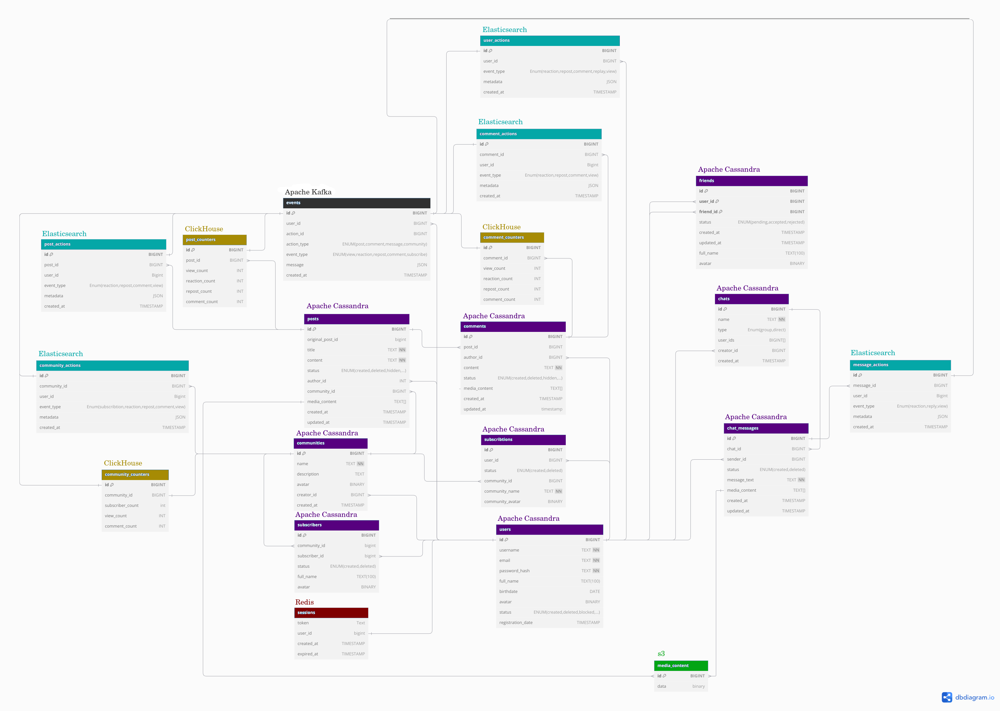

# highload_VK
Проект по курсу "Проектирование высоконагруженных систем" VK Education в МГТУ.

## 1. Тема и целевая аудитория 
**ВКонтакте**  — российская социальная сеть. 

### Целевая аудитория
**ВКонтакте** имеет более 105 миллионов активных пользователей в месяц[1].

| **Страна**              | **Количество пользователей в месяц, млн** |
| ----------------------- | ----------------------------------------- |
| Россия                  | 90 (Данные за 2024г.[2])                  |
| Беларусь                | 2,8 (Данные за 2023г.[3])                 |
| Казахстан               | 1,8 (Данные за 2019г.[4])                 |

### Ключевой функционал (MVP)
- Регистрация/Авторизация
- Сообщества (CRUD)
- Друзья (добавление/общение)
- Чаты (базовый функционал: написать сообщение, переслать)
- Посты (CRUD от сообщества и от человека)
- Лента рекомендаций
- Поиск (постов/сообществ/друзей)
- Комментирование (постов и комментариев)
- Реакции (постов и комментариев)
- Репосты (переслать пост/комментарий, сохранить в избранное)

### Ключевые продуктовые решения
- Настройки конфиденциальности
- Работа с медиа контентом

### Список источников
1. https://ria.ru/20230618/vkontakte-1878955016.html
2. https://vk.company/ru/press/releases/11757/
3. https://vk.company/ru/press/releases/11664/
4. https://tengrinews.kz/internet/nazvana-samaya-populyarnaya-sotsialnaya-set-v-kazahstane-377526/

## 2. Расчет нагрузки

### Продуктовые метрики
* Месячная аудитория(MAU) - 105 млн[1]
* Дневная аудитория(DAU) - 60 млн[1]

#### Средний размер хранилища пользователя
**Сообщения:**
<br/>
В среднем пользователи отправляют около `22,5 млн` сообщений в день[2].
Если предположить, что каждое сообщение занимает в среднем 1 КБ данных, то общее количество данных от сообщений будет:
`22,5 млн сообщений/день × 1 КБ = 22,5 ГБ`
<br/>
`22,5 ГБ / 60 млн = 1 КБ` на пользователя в день
<br/>
`1 КБ * 365 дней * 11 лет = 4 МБ` на пользователя за 11 лет
<br/>
<br/>
**Посты и комментарии:**
<br/>
В марте 2022 года пользователи ВКонтакте опубликовали более `468 млн` постов и комментариевх[3].
Если предположить, что каждый пост занимает в среднем 1 КБ данных, то общее количество данных от постов будет: `468 млн постов × 1 КБ = 468 ГБ`
<br/>
Среднее количество данных на одного пользователя от постов: `468 ГБ / 73,4 млн = 6,4 КБ`
<br/>
`6,4 КБ * 12 месяцев * 11 лет = 1 МБ` на пользователя за 11 лет
<br/>
<br/>
**Медиа контент:**
<br/>
В летние месяцы 2024 года на платформах VK загружалось до `1 ПБ` медиа-контента в день[4].
Среднее количество загружаемого контента на одного пользователя в день:
`1,000,000 ГБ / 3 / 76,900,000 пользователей​  = 4,4 МБ` на пользователя в день
<br/>
`4,4 МБ * 365 дней * 11 лет = 17 ГБ` на пользователя за 11 лет

| **Тип**                 | **Средний объем на 1 пользователя**       |
| ----------------------- | ----------------------------------------- |
| Сообщения               | 4 МБ                                      |
| Посты и комментарии     | 1 МБ                                      |
| Медиа контент           | 17 ГБ                                     |

#### Среднее количество действий пользователя по типам в день

| **Тип**                 | **Среднее количество на 1 пользователя в день**|
| ----------------------- | -----------------------------------------      |
| Сообщения               | 55 [5]                                         |
| Комментарии             | 5 [6]                                          |
| Лайки(реакции)          | 20 [5]                                         |
| Просмотры постов        | 100 [10]                                       |
| Размещение постов       | 1 [5]                                          |
| Репосты                 | 3 [7]                                          |
| Поисковые запросы       | 5 [7]                                          |
| Заявки в друзья         | 6 [9]                                          |
| Добавление в друзья     | 0,1 [9]                                        |
| Создание сообщества     | 0,0...1                                        |
| Вступление в сообщество | 0,02 [11]                                      |

### Технические метрики

#### Размер хранения в разбивке по типам данных 

В 2014 году ВКонтакте хранила около `250 ПБ`[8] данных. С тех пор количество пользователей и активность на платформе значительно увеличились. Если предположить, что объем данных растет пропорционально количеству пользователей и активности, можно сделать приблизительную оценку. Допустим, что объем данных увеличивается на 10-15% ежегодно. За 10 лет (с 2014 по 2024 год) это приведет к увеличению объема данных примерно в 2,6-4 раза. Таким образом, в 2024 году ВКонтакте может хранить около `1000 ПБ` пользовательских данных.

Можно ожидать, что объем данных увеличивается на `30 ПБ` ежегодно.

| **Тип**                 | **Объем хранилища, ТБ**      | **Прирост в год, ТБ** |
| ----------------------- | -----------------------------| --------------------- |
| Сообщения               | 235                          |  7                    |
| Посты и комментарии     | 60                           |  2                    |
| Медиа контент           | 999_705                      |  29_991               |

#### Сетевой трафик

| **Тип**         | **RPS средний** | **RPS пиковый**|Пиковое потребление в теченние суток (в Гбит/с)|Суммарный суточный (Гбайт/сутки) |
| ----------------------- | ----------------|----------------|------------------------------------------------------------|------------|
| Авторизация/регистрация | 1               | 2              |2 RPS * 0.5 КБ = 1 КБ/с = 0,001 МБ/с * 8 = 0,000008         |0,008       |
| Сообщения               | 39_000          | 65_000         |65000 RPS * 1 КБ = 65000 КБ/с = 65 МБ/с * 8 = 0,52          |4_000       |
| Комментарии             | 3_000           | 6_000          |6000 RPS * 2 КБ = 12000 КБ/с = 12 МБ/с * 8 = 0,096          |725         |
| Лайки(реакции)          | 18_800          | 23_000         |23000 RPS * 0.5 КБ = 11500 КБ/с = 11.5 МБ/с * 8 = 0,092     |695         |
| Лента рекомендаций      | 4_200           | 7_000          |7000 RPS * 50 КБ = 350000 КБ/с = 350 МБ/с * 8 = 2,8         |21_000      |
| Запросы медиа контента  | 105_000         | 175_000        |175_000 RPS * 7 КБ = 1_225_000 КБ/с = 1_225 МБ/с * 8 = 9,8  |105_840     |
| Размещение постов       | 690             | 1_150          |1150 RPS * 10 КБ = 11500 КБ/с = 11.5 МБ/с * 8 = 0,092       |695         |
| Репосты                 | 2_100           | 3_500          |3500 RPS * 3 КБ = 10500 КБ/с = 10.5 МБ/с * 8 = 0,084        |635         |
| Поисковые запросы       | 3_000           | 5_000          |5000 RPS * 6 КБ = 30000 КБ/с = 30 МБ/с * 8 = 0,24           |18_000      |
| Заявки в друзья         | 3_600           | 6_000          |6000 RPS * 1 КБ = 6000 КБ/с = 6 МБ/с * 8 = 0,048            |520         |
| Добавление в друзья     | 69              | 115            |115 RPS * 0.5 КБ = 58 КБ/с = 0,058 МБ/с * 8 = 0,00046       |5           |
| Создание сообществ      | 0,0...1         | 0,0...1        |...                                                         |0,0...1     |
| Вступление в сообщество | 15              | 24             |24 RPS * 0.5 КБ = 12 КБ/с = 0,012 МБ/с * 8 = 0,000096       |1           |
| Итого                   |                 |                |**13,77**                                                   |**152_116** |

### Список источников
1. https://corp.vkcdn.ru/media/2023/05/15/vk-company-limited-4-2022.pdf
2. https://brandanalytics.ru/blog/social-media-russia-2021/
3. https://m.vk.com/press/q1-2022-results
4. https://vk.company/ru/press/releases/11834/
5. https://vk.com/@live-stat
6. https://vc.ru/marketing/168366-statistika-vo-vkontakte-kak-i-kakie-pokazateli-otslezhivat-kak-povysit-ih-dinamiku
7. https://m.vk.com/wall-39599132_361495
8. https://vk.com/wall-32295218_252849?offset=60
9. https://vk.com/main.php?subdir=press&subsubdir=friends-research
10. https://psv4.userapi.com/c909218/u103517105/docs/d4/959b0b27debc/Press-kit_VKontakte_2024.pdf?extra=cP4QSas8sjn6QakB2fB13ooeXFfxZ_RHUP5rZ3_dmWyKlPWqerksYB4dp_h7vrask6kRXR3vzbpdW7Mj-bR5Dyv5KXdobN6Ubeyfgtavwxeeqv_lZesSkRpebOFTMGTQV848U1zfSmkxVWih
11. https://inclient.ru/vk-stats/#lwptoc2

## 3. Глобальная балансировка нагрузки

### Функциональное разбиение по доменам

+ **vk.com** - основной домен для отдачи статики
+ **login.vk.com** - домен для авторизации и регистрации
+ **feed.vk.com** - домен для реализации mvp социальной сети (сообщества, посты, лента рекомендаций)
+ **im.vk.com** - домен для реализации mvp мессенджера (друзья и чаты)
+ **sun.vk.com** - домен для отдачи пользовательских медиа-файлов

### Обоснования расположения ДЦ

Основная аудитория ВКонтакте находится в России, а так же в ближайших к России странах СНГ (Беларусь, Казахстан). Так как практически 75%[1] населения РФ пользуются ВК, следует размещать ДЦ ориентируясь на плотность заселения территорий страны.


#### Расположение ДЦ
+ **Санкт-Петербург** - будет обслуживать Северо-Западный и Центральный округа, а также Белорусь.
+ **Москва** - будет обслуживать Центральный, Северо-Кавказский и Приволжский округа.
+ **Новосибирск** - будет обслуживать Уральский и Сибирский округа, а также ближайшие страны Центральной Азии. Несмотря на большую площадь этих территорий, их плотность населения невелика, и, следовательно, общий трафик, приходящейся на этот ДЦ будет не столь велик.
+ **Хабаровск** - будет обслуживать Дальневосточна округ. Выделение отдельного ДЦ на Дальневосточны округ связано со значительным его удалением от других ДЦ, а также с быстрым развитием дальневосточного направления и большим увеличением аудитории ВК в последние годы[2].

### Схема DNS балансировки 

Так как ДЦ географически удалены, было бы разумно использовать Geo-based DNS. Однако из-зв того, что все ДЦ расположены в России (одной стране) могут возникать проблемы с резолвингом. Поэтому более удачным решением будет использование Latency-based DNS.

### Схема Anycast балансировки

 ДЦ, расположенные в Москве и Санкт-петербурге, испытывают потенциально наибольшую нагрузку. Поэтому будет разумно объединить их под одним IP адресом и использовать BGP Anycast. Для балансировки нагрузки между ними можно использовать распределение трафика по хэшам.

### Список источников
1. https://inclient.ru/vk-stats/
2. https://tass.ru/ekonomika/14162271

## 4. Локальная балансировка нагрузки

### Cхемы балансировки для входящих и межсервисных запросов
- До Nginx трафик будет балансироваться с помощью Virtual Server via Direct Routing.
- Nginx работает как HTTP Reverse Proxy балансировщик на уровне L7.
- Использование Redirect Based Load Balancing позволяет гибко управлять распределением нагрузки, что помогает обеспечить более равномерное распределение нагрузки между бэкендами, а также позволяет быстро переключаться на резервные серверы при отказе.
- Алгоритм Least Connections обеспечивает равномерное распределение нагрузки между бэкендами.

### Cхема отказоустойчивости
Для обеспечения отказоустойчивости будет использоваться k8s и Auto-scaling. Тем самым Service discovery будет реализован за счёт оркестрации. Система оркестрации при создании контейнера вносит экземпляр в реестр после успешного прохождение readiness пробы. Так же с помощью readiness-проб обеспечивается исключение из кластера упавших подов.

### Нагрузку по терминации SSL
Благодаря использованию session tickets можно ускорить процесс повторного подключения до одного round-trip вместо двух. Предположим, что трафик глобально балансируется ровномерно и на 1 ДЦ приходится 25% пикового RPS, то есть 60_000 RPS. Предположим, что половина из них будет совершать два round-trip. Обмен ключами будет занимать где-то 2мс, Тогда при пиковом RPS на терминацию SSL будет затрачиваться 30сек процессорного времени в секунду.

## 5. Логическая схема БД


<table>
	<thead>
		<tr>
			<th>Таблица</th>
			<th>Описание</th>
			<th>Размер одной записи</th>
            <th>Общий объем данных</th>
			<th>Нагрузка на чтение/запись</th>
			<th>Требования к согласованности</th>
		</tr>
	</thead>
	<tbody>
		<tr>
			<td>users</td>
			<td>Информация о пользователях</td>
			<td>~350 байт</td>
            <td>~50 ГБ</td>
			<td>Чтение: 1000 запросов в секунду<br>Запись: 50 запросов в секунду</td>
			<td>Строгая согласованность для уникальных полей</td>
		</tr>
		<tr>
			<td>sessions</td>
			<td>Сессии пользователей</td>
			<td>~50 байт</td>
            <td>~15 ГБ</td>
			<td>Чтение: 300000 запросов в секунду<br>Запись: 100 запросов в секунду</td>
			<td>Удаление записей при таймауте</td>
		</tr>
		<tr>
			<td>communities</td>
			<td>Информация о сообществах</td>
			<td>~400 байт</td>
            <td>~2 ГБ</td>
			<td>Чтение: 200 запросов в секунду<br>Запись: 5 запросов в секунду</td>
			<td>Строгая согласованность для уникальных полей</td>
		</tr>
		<tr>
			<td>subscribers</td>
			<td>Подписчики сообществ</td>
			<td>~100 байт</td>
            <td>~1 ТБ</td>
			<td>Чтение: 300 запросов в секунду<br>Запись: 15 запросов в секунду</td>
			<td>Строгая согласованность для уникальных полей, запись создается одновременно с записью в таблице subscribtions</td>
		</tr>
		<tr>
			<td>subscribtions</td>
			<td>Подписки пользователей (на сообщеста)</td>
			<td>~100 байт</td>
            <td>~1 ТБ</td>
			<td>Чтение: 400 запросов в секунду<br>Запись: 20 запросов в секунду</td>
			<td>Строгая согласованность для уникальных полейапись создается одновременно с записью в таблице subscribers</td>
		</tr>
		<tr>
			<td>friends</td>
			<td>Друзья</td>
            <td>~100 байт</td>
            <td>~15 ТБ</td>
			<td>Чтение: 150 запросов в секунду<br>Запись: 3000 запросов в секунду</td>
			<td>Строгая согласованность для уникальных полей</td>
		</tr>
		<tr>
			<td>chats</td>
			<td>Группы чатов</td>
			<td>~100 байт</td>
            <td>~1 TБ</td>
			<td>Чтение: 250 запросов в секунду<br>Запись: 12 запросов в секунду</td>
			<td>Строгая согласованность для уникальных полей</td>
		</tr>
		<tr>
			<td>chat_messages</td>
			<td>Сообщения в чатах</td>
			<td>~0.5 КБ</td>
            <td>~50 TБ</td>
			<td>Чтение: 600 запросов в секунду<br>Запись: 40000 запросов в секунду</td>
			<td>Строгая согласованность для уникальных полей</td>
		</tr>
		<tr>
			<td>posts</td>
			<td>Посты и репосты</td>
			<td>~1 КБ</td>
            <td>~10 TБ</td>
			<td>Чтение: 1000 запросов в секунду<br>Запись: 5000 запросов в секунду</td>
			<td>Строгая согласованность для уникальных полей</td>
		</tr>
		<tr>
			<td>comments</td>
			<td>Комментарии</td>
			<td>~0.5 КБ</td>
            <td>~20 TБ</td>
			<td>Чтение: 450 запросов в секунда<br>Запись: 6000 запросов в секунду</td>
			<td>Строгая согласованность для уникальных полей</td>
		</tr>
		<tr>
			<td>events</td>
			<td>События (сущность для передачи действий пользователей и обеспечения обновления метаданных об основных сущностях)</td>
            <td>~2 КБ</td>
			<td>~</td>
			<td>Чтение: 100000 запросов в секунду<br>Запись: 100000 запросов в секунду</td>
			<td>-</td>
		</tr>
		<tr>
			<td>post_counters</td>
			<td>Счетчики постов (просмотры, реакции, репосты, комментарии)</td>
			<td>~50 байт</td>
            <td>~5 ГБ</td>
			<td>Чтение: 1000 запросов в секунду<br>Запись: 10000 запросов в секунду</td>
			<td>Согласуется с post_actions</td>
		</tr>
		<tr>
			<td>comment_counters</td>
			<td>Счетчики комментариев (просмотры, реакции, репосты, комментарии)</td>
			<td>~50 байт</td>
            <td>~5 ГБ</td>
			<td>Чтение: 1000 запросов в секунду<br>Запись: 10000 запроса в секунду</td>
			<td>Согласуется с comment_actions</td>
		</tr>
		<tr>
			<td>community_counters</td>
			<td>Счетчики сообществ (подписки, просмотры)</td>
			<td>~50 байт</td>
            <td>~5 ГБ</td>
			<td>Чтение: 1000 запросов в секунду<br>Запись: 10000 запросов в секунду</td>
			<td>Согласуется с community_actions</td>
		</tr>
		<tr>
			<td>community_actions</td>
			<td>Действия в сообществах (логи, метаданные)</td>
			<td>~0.5 КБ</td>
            <td>~500 ГБ</td>
			<td>Чтение: 150 запросов в секунду<br>Запись: 10000 запросов в секунду</td>
			<td>Согласуется с events, согласованно с добавлением/удалением/изменением записей в соответствующих таблицах (communities, subscribers, subscribtions...) </td>
		</tr>
		<tr>
			<td>post_actions</td>
			<td>Действия с постами (логи, метаданные)</td>
			<td>~0.5 КБ</td>
            <td>~500 ГБ</td>
			<td>Чтение: 100 запросов в секунду<br>Запись: 10000 запросов в секунду</td>
			<td>Согласуется с events, согласованно с добавлением/удалением/изменением записей в соответствующих таблицах</td>
		</tr>
		<tr>
			<td>comment_actions</td>
			<td>Действия с комментариями (логи, метаданные)</td>
			<td>~0.5 КБ</td>
            <td>~500 ГБ</td>
			<td>Чтение: 80 запросов в секунду<br>Запись: 10000 запроса в секунду</td>
			<td>Согласуется с events, согласованно с добавлением/удалением/изменением записей в соответствующих таблицах</td>
		</tr>
		<tr>
			<td>user_actions</td>
			<td>Действия пользователей (логи, метаданные)</td>
			<td>~0.5 КБ</td>
            <td>~500 ГБ</td>
			<td>Чтение: 120 запросов в секунду<br>Запись: 10000 запросов в секунду</td>
			<td>Согласуется с events, согласованно с добавлением/удалением/изменением записей в соответствующих таблицах</td>
		</tr>
		<tr>
			<td>message_actions</td>
			<td>Действия с сообщениями (логи, метаданные)</td>
			<td>~0.5 КБ</td>
            <td>~500 ГБ</td>
			<td>Чтение: 60 запросов в секунду<br>Запись: 3 запроса в секунду</td>
			<td>Согласуется с events, согласованно с добавлением/удалением/изменением записей в соответствующих таблицах</td>
		</tr>
		<tr>
			<td>media_content</td>
			<td>Медиа-контент</td>
			<td>~1 MБ</td>
            <td>~5000 ТБ</td>
			<td>Чтение: 175000 запросов в секунду<br>Запись: 5000 запроса в секунду</td>
			<td>Удаление, при удаление записи со ссылкой на контент</td>
		</tr>
	</tbody>
</table>


## 6. Физическая схема БД



### Индексы

#### Индексы для таблицы subscribers

```
CREATE INDEX idx_subscribers_community_id ON subscribers(community_id);
CREATE INDEX idx_subscribers_subscriber_id ON subscribers(subscriber_id);
```

#### Индексы для таблицы friends

```
CREATE INDEX idx_friends_user1_id ON friends(user1_id);
CREATE INDEX idx_friends_user2_id ON friends(user2_id);
CREATE INDEX idx_friends_status ON friends(status);
```

#### Индексы для таблицы chat_messages

```
CREATE INDEX idx_chat_messages_chat_id ON chat_messages(chat_id);
CREATE INDEX idx_chat_messages_sender_id ON chat_messages(sender_id);
CREATE INDEX idx_chat_messages_created_at ON chat_messages(created_at);
```

#### Индексы для таблицы posts

```
CREATE INDEX idx_posts_community_id ON posts(community_id);
CREATE INDEX idx_posts_author_id ON posts(author_id);
CREATE INDEX idx_posts_created_at ON posts(created_at);
```

#### Индексы для таблицы comments

```
CREATE INDEX idx_comments_post_id ON comments(post_id);
CREATE INDEX idx_comments_author_id ON comments(author_id);
CREATE INDEX idx_comments_created_at ON comments(created_at);
```

#### Индексы для таблицы events

```
CREATE INDEX idx_events_user_id ON events(user_id);
CREATE INDEX idx_events_type ON events(type);
CREATE INDEX idx_events_created_at ON events(created_at);
```

#### Индексы для таблиц ..._statistics

```
CREATE INDEX idx_..._statistics_..._id ON ..._statistics(..._id);
CREATE INDEX idx_..._statistics_user_id ON ..._statistics(user_id);
CREATE INDEX idx_..._statistics_event_type ON ..._statistics(event_type);

```